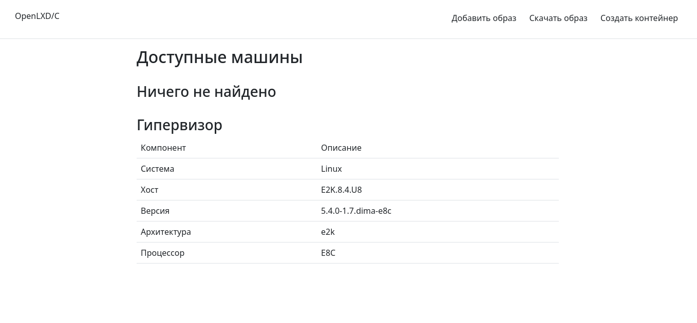
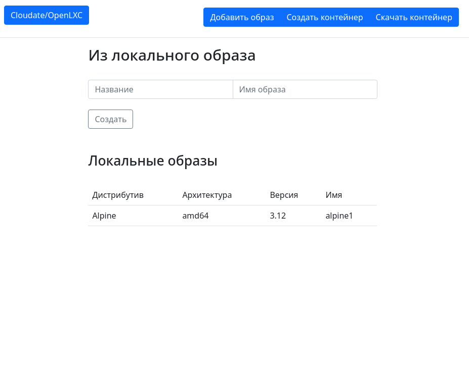

# OpenLXC (Demo)

## Pre-install
### Optional
```
openssl req -newkey rsa:2048 -nodes -keyout lxd.key -out lxd.csr
openssl x509 -signkey lxd.key -in lxd.csr -req -days 365 -out lxd.crt
```
### Run
```
git clone https://github.com/rombintu/openlxc.git
cd openlxc
python3 src/config.py
pip install -r reqs.txt
cp .env.bak .env
flask run
```

## Screenshots


